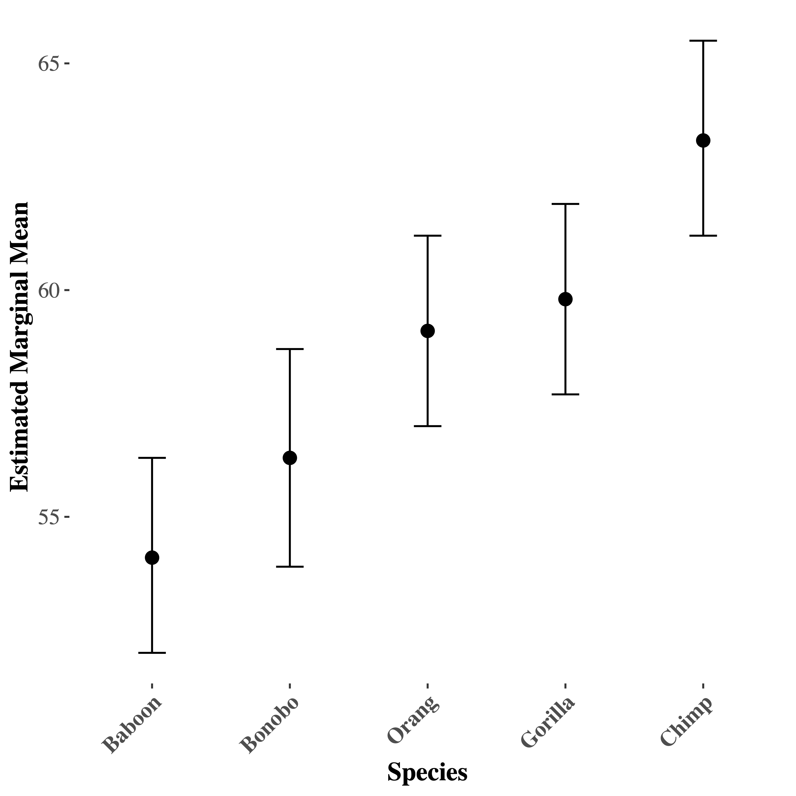
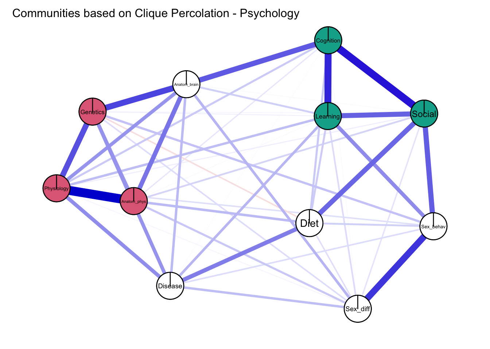

```{r setup, include=FALSE}
options(htmltools.dir.version = FALSE)
knitr::opts_chunk$set(echo = TRUE)
```

```{r echo=F, message=F, warning = F}
require(xaringanExtra) 
require(stargazer)
require(tidyverse)
require(knitr)
require(kableExtra)
require(DT)
require(emojifont)
```

```{r xaringan-logo, echo=FALSE}
xaringanExtra::use_logo("NU2.png")
```

```{r xaringan-tile-view, echo=FALSE}
xaringanExtra::use_tile_view()
# Below generates a new class of simulation table, as otherwise it will not fit.
```

```{css, echo = F}
table {
  font-size: 16px;     
}
```

```{css, echo = F}
.simulation_small table {
  font-size: 5.9px;     
}
```

```{css, echo = F}
.simulation table {
  font-size: 10px;     
}
```

## Today

* Work in progress.

* Largely exploratory project.

```{r, out.width = "400px", echo=FALSE, fig.align='center'}
knitr::include_graphics("https://media2.giphy.com/media/v1.Y2lkPTc5MGI3NjExNHAwMHZlc3p5NDRnbXg0dGdoNTFpNDhmenEycmpkYXMxa3BxZTB4diZlcD12MV9pbnRlcm5hbF9naWZfYnlfaWQmY3Q9Zw/cemlTZGCXZOwdVi3kp/giphy.gif")
```

---
## Back story

* Grant on Evolutionary Psychology text books and 'tokenism' (and perceptions).

--

* Picking certain cultures and species (but then not others).

--

* When coding examples of primates in textbooks - Example species chosen.

--

* For example, Buss (2019: 502) writes: _‘other primates besides humans, such as chimpanzees, baboons, and macaques, also engage in reciprocal helping (de Waal, 1982). Taken together, this evidence suggests a long evolutionary history of altruism.’._

```{r, out.width = "250px", echo=FALSE, fig.align='center'}
knitr::include_graphics("https://media0.giphy.com/media/v1.Y2lkPTc5MGI3NjExeGtnYWR0c2xsdzBkdnRyenl3MXk0Mng1bHpibTlkbHdxMnYyd3c2YSZlcD12MV9pbnRlcm5hbF9naWZfYnlfaWQmY3Q9Zw/3orieS4jfHJaKwkeli/giphy.gif") 
```


???
Scorpionflies...
---
## Preconceptions about similarity to humans

* What are students' preconceptions about a species's similarity to humans?

--

* At a later stage perhaps link the usage of examples in textbooks to these preconceptions.

--

```{r, out.width = "400px", echo=FALSE, fig.align='center'}
 
```

---
## This project

* How do students perceive similarity of species to humans - and what is the role of different domains (e.g., Diet vs. sociality)? 

--

* Two studies: Primates / Other species

--

* Largely explorative project - but we pre-registered an analysis plan.

--

* 'Psychonetrics' to evaluate grouping of domains. More about that soon.


```{r, out.width = "300px", echo=FALSE, fig.align='center'}
knitr::include_graphics("https://media4.giphy.com/media/v1.Y2lkPTc5MGI3NjExbTA4MWVvOGdpYjZkZDdlMnBuaGxjZ2EwdG80NzNjMmk4anU1N3o2ZiZlcD12MV9pbnRlcm5hbF9naWZfYnlfaWQmY3Q9Zw/fw8uZriJW4TlhmZnUj/giphy.gif") 
```

???


---
## Study 1 : Methodology - Online Survey (Qualtrics)

* **Prolific Sample**. To the best of our ability, balanced between 'Biology' (final _n_ = 220) and 'Psychology' (final _n_ = 243) degrees. Next, we attempted to balance based on Gender and country. 

--

* Roughly equal split in gender categories (M/F), median age = 25 years. Around three out of four: UK/US resident (76%).

--

* Rated Baboon, Orang utan, Gorilla, Bonobo and Chimp  across 11 domains (Diet, Physical Anatomy, Brain Anatomy, Cognition, Sexual Behaviour, Disease, Physiology, Learning behaviour, Social Behaviour, Sex differences, and Genetics). On a 0 - 100 slider.

--

```{r, out.width = "300px", echo=FALSE, fig.align='center'}
knitr::include_graphics("https://media2.giphy.com/media/v1.Y2lkPTc5MGI3NjExYWUyeXRvd3d6OXNpbHY0eWdncm45MzBlMXB5dmswMnBsdzF0dTJzZSZlcD12MV9pbnRlcm5hbF9naWZfYnlfaWQmY3Q9Zw/5htGFvTSehTxWdysds/giphy.gif") 
```

---
## Study 1: Methodology (cont'd)

* "_You will now be asked to rate the similarity of non-human primate species to humans with 0 indicating 'not at all similar', and 100 indicating 'totally similar' across a series of domains._" (Block randomised based on species, and then randomised domain within that block)

--

* Some sociodemographics and some background questions (Knowledge / Interest in Primates / zoo visits / interests in documentaries on primates).

--

* Focus is on how the domains cluster in this rating task: **Psychonetrics**

```{r, out.width = "300px", echo=FALSE, fig.align='center'}
knitr::include_graphics("https://media1.giphy.com/media/v1.Y2lkPTc5MGI3NjExd3k1Zmk4OW5rajJiOGhsMjRpdTQ2bGh3eTFweWZqcWRyaHAya3k4bCZlcD12MV9pbnRlcm5hbF9naWZfYnlfaWQmY3Q9Zw/f0LPcE2CZkOKLG3EL0/giphy.gif") 
```

---
## Psychonetrics

* As an input we take the correlations between items. The method we use allows picking the appropriate correlation method (continuous, ordinal or tetrachoric).

--

* Implemented via `bootnet` -- here we used `EBICglasso` to estimate a 'Graphical Gaussian Model' (GGM). Default tuning parameter of .5, trade-off between sparsity vs. precision.

--

* In a GGM, nodes represent the variables (e.g., items), and edges represent partial correlations between variables, i.e. correlations after adjusting for all other variables in the network.

--

* Widely used to model symptom networks, etc. This is a method for variable selection. See [Constantini et al. 2015](https://doi.org/10.1016/j.jrp.2014.07.003) for a tutorial.

---
## Clique percolation method (CPM, Lange, 2011)

* Many algorithmic methods exist to find structure in networks ("clusters"/"modules"/"communities"): [Louvain method](https://doi.org/10.1088/1742-5468/2008/10/P10008) (Blondel et al., 2008) / [Leiden method](https://doi.org/10.1038/s41598-019-41695-z) (Traag et al.2019)

--

* Most algorithms force unique cluster membership, and also force that each node is part of a cluster. --> not case for CPM

--

* Very simply put: This method first identifies 'cliques' (in our case k = 3), next examine if these cliques overlap ("adjacent").  Next via "percolation", we grow 'communities' via joining up these adjacent cliques.

--

Implemented via `CliquePercolation` package in an algorithmic way. **Key point**: nodes can be part of more than one cluster. Isolates can exist.

```{r cliquepercolation, out.width = "200px", echo=FALSE, fig.align='center', fig.cap= "Thierry Dugnolle, CC BY-SA 4.0 <https://creativecommons.org/licenses/by-sa/4.0>, via Wikimedia Commons"}
knitr::include_graphics("https://upload.wikimedia.org/wikipedia/commons/f/f5/Percolation_p%3D0.51.gif")
```

---
## 'Invariance testing'

Using a network comparison test, we can compare network structures between groups. [(van Borkulo et al., 2023)](https://doi.org/10.1037/met0000476).

--> **Permutations**

```{r out.width = "500px", echo=FALSE, fig.align='center'}

```


---
## Results

* Some descriptions, (exploratory) t-tests, (exploratory) signed rank tests, and (exploratory) ANOVAs.

--

* Mostly graphs.

```{r out.width = "500px", echo=FALSE, fig.align='center'}
knitr::include_graphics("results_meme.jpg")
```

---
## Unsurprising findings (exploratory)

* Biology students (_M_ = 49.97; _SD_ = 22.00) reported greater knowledge on primates than psychology students (_M_ = 40.73; _SD_ = 22.68), _t(458.82)_ = 4.45, _p_ < .0001, _d_ = .414.

--

* Biology students (_M_ = 54.53; _SD_ = 22.81) reported greater interests in primates than psychology students (_M_ = 46.09; _SD_ = 23.61), _t(459.03)_ = 3.91, _p_ = .0001, _d_ = .363.

--

* No significant difference in visits to zoo (W = 25986, _p_ = .588) or watching documentary on primates (W = 27045, _p_ = .823)

???
prim_documentary == "Monthly" ~ 6,
prim_documentary == "Weekly" ~ 5,
prim_documentary == "Multiple times a year" ~ 4,
prim_documentary == "Once every two years" ~ 3,
prim_documentary == "Once a year" ~ 2,
prim_documentary == "Never" ~ 1


---
## Exploratory ANOVA on ratings

| Effect                          | df               | MSE     | F        | η²   | p      |
|---------------------------------|------------------|---------|----------|-------|---------|
| Discipline Prolific             | 1, 441           | 14167.72| 15.94 | .017  | <.001   |
| trait                           | 6.92, 3052.98    | 1046.31 | 56.04 | .030  | <.001   |
| Discipline Prolific:trait       | 6.92, 3052.98    | 1046.31 | 2.34  | .001  | .023    |
| species                         | 3.74, 1648.59    | 864.36  | 74.10 | .018  | <.001   |
| Discipline Prolific:species     | 3.74, 1648.59    | 864.36  | 0.11  | <.001 | .974    |
| trait:species                   | 33.31, 14690.44  | 147.06  | 4.04  | .002  | <.001   |
| Discipline Prolific:trait:species| 33.31, 14690.44  | 147.06  | 0.82 | <.001 | .755    |

???
generalised eta squared


---
## Plot: Discipline

```{r, out.width = "500px", echo=FALSE, fig.align='center'}

```

---
## Plot: Traits

```{r, out.width = "650px", echo=FALSE, fig.align='center'}
knitr::include_graphics("em_traits_1.png")
```

---
## Plot: Species

```{r, out.width = "500px", echo=FALSE, fig.align='center'}

```

---
## Network Invariance: Comparing across primates.

**Network invariance**: all _p_ > .2 --> Structure is roughly the same.

**Strength invariance**: 

- Gorilla - Orang , _p_ = .031
- Gorilla - Chimp , _p_ = .073


--> Overall picture across all species.


```{r, out.width = "400px", echo=FALSE, fig.align='center'}
knitr::include_graphics("https://media3.giphy.com/media/v1.Y2lkPTc5MGI3NjExMWZ2bGEwODVjb2t5dTJ4MDM3enAxb2M0cHA5NHF5cWp6Y2RvbXc1ciZlcD12MV9pbnRlcm5hbF9naWZfYnlfaWQmY3Q9Zw/Xy6inZukve79w0VRyg/giphy.gif")
```

---
## Psychonetrics: Overall

```{r, out.width = "700px", echo=FALSE, fig.align='center'}

```

---
## Invariance: Biology vs. Psychology

They do differ:

**Network invariance**: _p_ = .0009 

**Strength invariance**: _p_ = .609

--> but both have two clusters of 3 nodes.

```{r, out.width = "350px", echo=FALSE, fig.align='center'}
knitr::include_graphics("https://media3.giphy.com/media/v1.Y2lkPTc5MGI3NjExOXlkZm9iZGt3eGNnZTJhczZnMHZoMTMwYmRqeTQxeWphYWE2MGZ3ZCZlcD12MV9pbnRlcm5hbF9naWZfYnlfaWQmY3Q9Zw/xBIuPT5pjvarJZXyBw/giphy.gif")
```

---
## Biology

```{r, out.width = "700px", echo=FALSE, fig.align='center'}

```

---
## Psychology

```{r, out.width = "700px", echo=FALSE, fig.align='center'}

```

---
## Interim conclusion

* Clustering of traits: "learning, social, cognition" and "genetics, physiology, physical anatom" 

--

* Different organisation between psychology and biology students but both seem to have the two above clusters.

```{r, out.width = "300px", echo=FALSE, fig.align='center'}

```


---
## Study 2: `r emoji("ant")`, `r emoji("duck")`, `r emoji("mouse")`, `r emoji("dolphin")`, `r emoji("monkey")`

* Repeat the exercise with: `r emoji("ant")`, `r emoji("duck")`, `r emoji("mouse")`, `r emoji("dolphin")`, `r emoji("monkey")`. 

--


* Final _n_ = 470. 228 men, 227 women, 15 non-binary or third gender. Approx. 80%. from UK and US.

--

* 'Biology' (final _n_ = 248) and 'Psychology' (final _n_ = 222)

```{r, out.width = "400px", echo=FALSE, fig.align='center'}

```


---
## Unsurprising findings (exploratory)

* Biology students (_M_ = 58.02; _SD_ = 21.31) reported greater knowledge on animals than psychology students (_M_ = 50.08; _SD_ = 19.88), _t(467.19)_ = 4.18, _p_ < .0001, _d_ = .385.

--

* Biology students (_M_ = 65.27; _SD_ = 21.20) reported greater interests in primates than psychology students (_M_ = 58.50; _SD_ = 20.55), _t(465.05)_ = 3.51, _p_ = .0001, _d_ = .324.

--

* Significant difference in visits to zoo (W = 31456, _p_ = .005) or watching documentary on nature (W = 31284, _p_ = .008).


---
## Mixed model ANOVA (exploratory)

| Effect                          | df               | MSE     | F           | η²   | p      |
|---------------------------------|------------------|---------|-------------|-------|---------|
| Discipline Prolific             | 1, 455           | 12394.99| 1.60        | .001  | .206    |
| trait                           | 6.86, 3121.58    | 809.43  | 134.91      | .049  | <.001   |
| Discipline Prolific:trait       | 6.86, 3121.58    | 809.43  | 4.40        | .002  | <.001   |
| species                         | 3.52, 1602.37    | 1742.36 | 1287.30     | .352  | <.001   |
| Discipline Prolific:species     | 3.52, 1602.37    | 1742.36 | 0.29        | <.001 | .860    |
| trait:species                   | 29.68, 13506.48  | 266.54  | 89.76       | .047  | <.001   |
| Discipline Prolific:trait:species| 29.68, 13506.48  | 266.54  | 1.60       | <.001 | .021    |

---
## Plot: Discipline

```{r, out.width = "500px", echo=FALSE, fig.align='center'}

```

---
## Plot: Traits

```{r, out.width = "500px", echo=FALSE, fig.align='center'}

```


---
## Plot: Species

```{r, out.width = "500px", echo=FALSE, fig.align='center'}

```

---
## Network Invariance: Comparing across species

**Network invariance**: some _p_ < .1; Dolphin - ant, p = .045; Duck - ant , _p_ = .056; Duck - Dolphin, _p_ = .051; Mouse - Duck, _p_ = .075, Mouse - Ant, _p_ = .045

--> None of these survive correction for multiple testing suggests we can broadly compare... . It's to be expected we'll find some different layouts given the different target species - but suggestive of roughly similar layout of domains.

--

**Strength invariance**: 

Some of these are different at _p_ = .001 (Mouse vs. Ant; Duck vs. Chimp; Chimp vs. Ant).  This implies the strength of the edges between the nodes could vary between species. 

```{r, out.width = "250px", echo=FALSE, fig.align='center'}
knitr::include_graphics("duck_cute.png")
```
---
## Ant - `r emoji("ant")`

```{r, out.width = "700px", echo=FALSE, fig.align='center'}

```

---
## Duck - `r emoji("duck")`

```{r, out.width = "700px", echo=FALSE, fig.align='center'}

```

---
## Mouse - `r emoji("mouse")`

```{r, out.width = "700px", echo=FALSE, fig.align='center'}
knitr::include_graphics("Mouse.png")
```

---
## Dolphin - `r emoji("dolphin")`

```{r, out.width = "700px", echo=FALSE, fig.align='center'}

```

---
## Chimp - `r emoji("monkey")`

```{r, out.width = "700px", echo=FALSE, fig.align='center'}

```

---
## Overall picture

```{r, out.width = "700px", echo=FALSE, fig.align='center'}

```

---
## Comparing biology / psychology students

They don't significantly differ:

**Network invariance**: _p_ = .457

**Strength invariance**: _p_ = .245

```{r, out.width = "400px", echo=FALSE, fig.align='center'}
knitr::include_graphics("https://media1.giphy.com/media/v1.Y2lkPTc5MGI3NjExN3Q0MWJ3cmhwNXZveDZ0NjF0OTJtZGs2b2UwNWVuMWtneTdreTRrZiZlcD12MV9pbnRlcm5hbF9naWZfYnlfaWQmY3Q9Zw/MDs0DZLHum4BRJglM5/giphy.gif")
```


---
## Limitations

* Prolific sample

--

* Species chosen

--

* Strange task - anchored at humans

```{r, out.width = "450px", echo=FALSE, fig.align='center'}
knitr::include_graphics("https://media1.giphy.com/media/v1.Y2lkPTc5MGI3NjExcmRmb3V0bW00aHMyanA3dXE1NXJxaWxwMnlia3NyZ3B4cm9zYWI5ZiZlcD12MV9pbnRlcm5hbF9naWZfYnlfaWQmY3Q9Zw/yyhJaoPDhCbBu/giphy.gif")
```


---
## Moving forward... 

* Experts with same design.

--

* Just write the bloody paper ;).


```{r, out.width = "450px", echo=FALSE, fig.align='center'}
knitr::include_graphics("https://media4.giphy.com/media/v1.Y2lkPTc5MGI3NjExZnk3ZjRvYmRmejBrdGhrZnlqaDc4bHVzbnBlYzBxaXAyZXEyd2xwYyZlcD12MV9pbnRlcm5hbF9naWZfYnlfaWQmY3Q9Zw/a9d3bbcM3ImXe/giphy.gif")
```

---
## Any Questions?

[http://tvpollet.github.io](http://tvpollet.github.io)

Twitter: @tvpollet

```{r, out.width = "600px", echo=FALSE, fig.align='center'}
knitr::include_graphics("https://media.giphy.com/media/3ohzdRoOp1FUYbtGDu/giphy.gif")
```

---
## Acknowledgments

* I am greatly indebted to my collaborator(s). (Any mistakes are my own!).

* Funded by British Academy.

* You for listening!

```{r, out.width = "500px", echo=FALSE, fig.align='center'}
knitr::include_graphics("https://media.giphy.com/media/10avZ0rqdGFyfu/giphy.gif")
```


